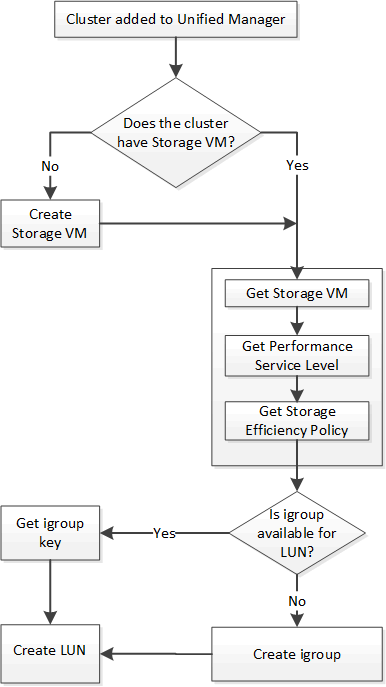

= Provisionner les LUN
:allow-uri-read: 
:icons: font
:imagesdir: ../media/

[role="lead"]
Vous pouvez provisionner des LUN sur vos SVM (Storage Virtual machines) en utilisant les API de provisionnement fournies par Active IQ Unified Manager. Ce workflow de provisionnement détaille les étapes à suivre pour récupérer les clés des SVM, les niveaux de service performances et les règles d'efficacité du stockage avant de créer la LUN.

Le schéma suivant illustre les étapes d'un workflow de provisionnement de LUN.

[NOTE]
====
Ce flux de travail suppose que les clusters ONTAP ont été ajoutés à Unified Manager et que la clé de cluster a été obtenue. Le workflow suppose également que les SVM ont déjà été créés sur les clusters.

====
. Obtenir la clé SVM pour le SVM sur lequel vous souhaitez créer la LUN, comme décrit dans la rubrique _Vérification des SVM sur les clusters_ workflow.
. Obtenir la clé pour le niveau de service des performances en exécutant l'API suivante et en récupérant la clé de la réponse.

[cols="3*"]
|===
| Catégorie | Verbe HTTP | Chemin 

 a| 
fournisseur de stockage
 a| 
OBTENEZ
 a| 
`/storage-provider/performance-service-levels`

|===
[NOTE]
====
Pour récupérer les détails des niveaux de service de performances définis par le système, définissez le paramètre `system_defined` saisissez le paramètre à `true`. Dans le résultat de cette commande, vous devez obtenir la clé du niveau de service de performances que vous souhaitez appliquer sur le LUN.

====
. Si vous le souhaitez, vous pouvez également obtenir la clé de la politique d'efficacité du stockage que vous souhaitez appliquer sur la LUN en exécutant l'API suivante et en récupérant la clé de la réponse.

[cols="3*"]
|===
| Catégorie | Verbe HTTP | Chemin 

 a| 
fournisseur de stockage
 a| 
OBTENEZ
 a| 
`/storage-provider/storage-efficiency-policies`

|===
. Déterminez si des groupes initiateurs (igroups) ont été créés pour autoriser l'accès à la cible de LUN que vous souhaitez créer.

[cols="3*"]
|===
| Catégorie | Verbe HTTP | Chemin 

 a| 
data center
 a| 
OBTENEZ
 a| 
`/datacenter/protocols/san/igroups`  `+/datacenter/protocols/san/igroups/{key}+`

|===
Vous devez saisir la valeur de paramètre pour indiquer la SVM pour laquelle le groupe initiateur a autorisé l'accès. En outre, pour effectuer une requête sur un groupe initiateur spécifique, entrez le nom de ce groupe initiateur (clé) comme paramètre d'entrée.

. Dans le résultat de cette commande, si vous trouvez le groupe initiateur auquel vous souhaitez accorder l'accès, obtenez la clé. Sinon, créez le groupe initiateur.

[cols="3*"]
|===
| Catégorie | Verbe HTTP | Chemin 

 a| 
data center
 a| 
POST
 a| 
`/datacenter/protocols/san/igroups`

|===
Vous devez entrer les détails du groupe initiateur que vous souhaitez créer en tant que paramètres d'entrée. Il s'agit d'un appel synchrone pour vérifier la création du groupe initiateur dans la sortie. En cas d'erreur, un message s'affiche pour vous permettre de dépanner et de relancer l'API.

. Créer la LUN.

[cols="3*"]
|===
| Catégorie | Verbe HTTP | Chemin 

 a| 
fournisseur de stockage
 a| 
POST
 a| 
`/storage-provider/luns`

|===
Pour créer la LUN, assurez-vous d'avoir ajouté les valeurs récupérées en tant que paramètres d'entrée obligatoires.

[NOTE]
====
La stratégie d'efficacité du stockage est un paramètre facultatif pour la création des LUN.

====
*CURL d'échantillon*

Vous devez entrer tous les détails de la LUN que vous souhaitez créer en tant que paramètres d'entrée.

[listing]
----
curl -X POST "https://<hostname>/api/storage-provider/luns" -H "accept: application/json" -H
    "Content-Type: application/json" -H "Authorization: Basic <Base64EncodedCredentials>" -d
    "{ \"name\": \"MigrationLunWithVol\", \"os_type\": \"windows\",
    \"performance_service_level\": { \"key\": \"7873dc0d-0ee5-11ea-82d7-fa163ea0eb69\" },
    \"space\": { \"size\": 1024000000 }, \"svm\": { \"key\":
    \"333fbcfa-0ace-11ea-9d6d-00a09897cc15:type=vserver,uuid=4d462ec8-0f56-11ea-9d6d-00a09897cc15\"
    }}"
----
La sortie JSON affiche une clé d'objet travail que vous pouvez utiliser pour vérifier la LUN que vous avez créée.

. Vérifiez la création de la LUN à l'aide de la clé de l'objet travail renvoyée dans l'interrogation du travail :

[cols="3*"]
|===
| Catégorie | Verbe HTTP | Chemin 

 a| 
serveur-gestion
 a| 
OBTENEZ
 a| 
`+/management-server/jobs/{key}+`

|===
À la fin de la réponse, vous voyez la clé de la LUN créée.

[listing]
----
    {
      "name": "lunKey",
      "value": "key": "f963839f-0f95-11ea-9963-00a098884af5:type=lun,uuid=71f3187e-bf19-4f34-ba34-b1736209b45a"
    }
 ],
 "_links": {
    "self": {
      "href": "/api/management-server/jobs/fa7c856d29e2b80f%3A-8d3325d%3A16e9eb5ed6d%3A-548b"
    }
 }
}
----
. Vérifiez la création de la LUN en exécutant l'API suivante avec la clé renvoyée :

[cols="3*"]
|===
| Catégorie | Verbe HTTP | Chemin 

 a| 
fournisseur de stockage
 a| 
OBTENEZ
 a| 
`+/storage-provider/luns/{key}+`

|===
*Sortie JSON échantillon*

Vous pouvez voir que la méthode POST de `/storage-provider/luns` Appelle en interne toutes les API requises pour chacune des fonctions et crée l'objet. Par exemple, il invoque le `/storage-provider/performance-service-levels/` API permettant d'attribuer un niveau de service de performances à la LUN.

[listing]
----
{
  "key": "f963839f-0f95-11ea-9963-00a098884af5:type=lun,uuid=71f3187e-bf19-4f34-ba34-b1736209b45a",
  "name": "/vol/NSLM_VOL_LUN_1574753881051/LunForTesting1",
  "uuid": "71f3187e-bf19-4f34-ba34-b1736209b45a",
  "cluster": {
    "uuid": "f963839f-0f95-11ea-9963-00a098884af5",
    "key": "f963839f-0f95-11ea-9963-00a098884af5:type=cluster,uuid=f963839f-0f95-11ea-9963-00a098884af5",
    "name": "sti2552-4451574693410",
    "_links": {
      "self": {
        "href": "/api/datacenter/cluster/clusters/f963839f-0f95-11ea-9963-00a098884af5:type=cluster,uuid=f963839f-0f95-11ea-9963-00a098884af5"
      }
    }
  },
  "svm": {
    "uuid": "7754a99c-101f-11ea-9963-00a098884af5",
    "key": "f963839f-0f95-11ea-9963-00a098884af5:type=vserver,uuid=7754a99c-101f-11ea-9963-00a098884af5",
    "name": "Testingsvm1",
    "_links": {
      "self": {
        "href": "/api/datacenter/svm/svms/f963839f-0f95-11ea-9963-00a098884af5:type=vserver,uuid=7754a99c-101f-11ea-9963-00a098884af5"
      }
    }
  },
  "volume": {
    "uuid": "961778bb-2be9-4b4a-b8da-57c7026e52ad",
    "key": "f963839f-0f95-11ea-9963-00a098884af5:type=volume,uuid=961778bb-2be9-4b4a-b8da-57c7026e52ad",
    "name": "NSLM_VOL_LUN_1574753881051",
    "_links": {
      "self": {
        "href": "/api/datacenter/storage/volumes/f963839f-0f95-11ea-9963-00a098884af5:type=volume,uuid=961778bb-2be9-4b4a-b8da-57c7026e52ad"
      }
    }
  },
  "assigned_performance_service_level": {
    "key": "861f6e4d-0c35-11ea-9d73-fa163e706bc4",
    "name": "Value",
    "peak_iops": 75,
    "expected_iops": 75,
    "_links": {
      "self": {
        "href": "/api/storage-provider/performance-service-levels/861f6e4d-0c35-11ea-9d73-fa163e706bc4"
      }
    }
  },
  "recommended_performance_service_level": {
    "key": null,
    "name": "Idle",
    "peak_iops": null,
    "expected_iops": null,
    "_links": {}
  },
  "assigned_storage_efficiency_policy": {
    "key": null,
    "name": "Unassigned",
    "_links": {}
  },
  "space": {
    "size": 1024458752
  },
  "os_type": "linux",
  "_links": {
    "self": {
      "href": "/api/storage-provider/luns/f963839f-0f95-11ea-9963-00a098884af5%3Atype%3Dlun%2Cuuid%3D71f3187e-bf19-4f34-ba34-b1736209b45a"
    }
  }
}
----

== Procédure de dépannage en cas de échec de la création ou du mappage de LUN

À l'issue de ce workflow, il se peut que la création de LUN ait échoué. Même si la LUN est correctement créée, le mappage de LUN avec le groupe initiateur peut échouer en raison d'une indisponibilité d'une LIF SAN ou d'un point de terminaison d'accès sur le nœud sur lequel vous créez la LUN. En cas de défaillance, le message suivant s'affiche :

[listing]
----
The nodes <node_name> and <partner_node_name> have no LIFs configured with the iSCSI or FCP protocol for Vserver <server_name>. Use the access-endpoints API to create a LIF for the LUN.
----
Suivez ces étapes de dépannage pour contourner ce problème.

. Créer un point d'accès prenant en charge le protocole ISCSI/FCP sur le SVM sur lequel vous avez essayé de créer la LUN.

[cols="3*"]
|===
| Catégorie | Verbe HTTP | Chemin 

 a| 
fournisseur de stockage
 a| 
POST
 a| 
`/storage-provider/access-endpoints`

|===
*CURL d'échantillon*

Vous devez entrer les détails du point final d'accès que vous souhaitez créer, en tant que paramètres d'entrée.

[NOTE]
====
Assurez-vous que dans le paramètre d'entrée que vous avez ajouté le `address` Pour indiquer le home node de la LUN et du `ha_address` pour indiquer le nœud partenaire du nœud de rattachement. Lorsque vous exécutez cette opération, des terminaux d'accès sont créés sur le nœud de rattachement et le nœud partenaire.

====
[listing]
----
curl -X POST "https://<hostname>/api/storage-provider/access-endpoints" -H "accept:
    application/json" -H "Content-Type: application/json" -H "Authorization: Basic <Base64EncodedCredentials>" -d "{ \"data_protocols\": [ \"iscsi\" ], \"ip\": {
    \"address\": \"10.162.83.126\", \"ha_address\": \"10.142.83.126\", \"netmask\":
    \"255.255.0.0\" }, \"lun\": { \"key\":
    \"e4f33f90-f75f-11e8-9ed9-00a098e3215f:type=lun,uuid=b8e0c1ae-0997-47c5-97d2-1677d3ec08ff\" },
    \"name\": \"aep_example\" }"
----
. Interroger le travail avec la clé objet Job renvoyée dans la sortie JSON pour vérifier qu'elle s'exécute correctement pour ajouter les terminaux d'accès sur la SVM et que les services iSCSI/FCP ont été activés sur la SVM.

[cols="3*"]
|===
| Catégorie | Verbe HTTP | Chemin 

 a| 
serveur-gestion
 a| 
OBTENEZ
 a| 
`+/management-server/jobs/{key}+`

|===
*Sortie JSON échantillon*

À la fin de la sortie, vous pouvez voir la clé des points d'extrémité d'accès créés. Dans le résultat suivant, le `"name": "accessEndpointKey"` Valeur indique le noeud final d'accès créé sur le noeud d'origine de la LUN, pour lequel la clé est `9c964258-14ef-11ea-95e2-00a098e32c28`. Le `"name": "accessEndpointHAKey"` valeur indique le noeud final d'accès créé sur le noeud partenaire du noeud d'accueil pour lequel la clé est `9d347006-14ef-11ea-8760-00a098e3215f`.

[listing]
----
  "job_results": [
    {
      "name": "accessEndpointKey",
      "value": "e4f33f90-f75f-11e8-9ed9-00a098e3215f:type=network_lif,lif_uuid=9c964258-14ef-11ea-95e2-00a098e32c28"
    },
    {
      "name": "accessEndpointHAKey",
      "value": "e4f33f90-f75f-11e8-9ed9-00a098e3215f:type=network_lif,lif_uuid=9d347006-14ef-11ea-8760-00a098e3215f"
    }
  ],
  "_links": {
    "self": {
      "href": "/api/management-server/jobs/71377eeea0b25633%3A-30a2dbfe%3A16ec620945d%3A-7f5a"
    }
  }
}
----
. Modifiez la LUN pour mettre à jour le mappage de groupe initiateur. Pour plus d'informations sur la modification des flux de travail, reportez-vous à la section « Modifier les charges de travail de stockage ».

[cols="3*"]
|===
| Catégorie | Verbe HTTP | Chemin 

 a| 
fournisseur de stockage
 a| 
CORRECTIF
 a| 
`+/storage-provider/lun/{key}+`

|===
Dans le champ d'entrée, spécifiez la clé igroup avec laquelle vous souhaitez mettre à jour le mappage de LUN, ainsi que la clé de LUN.

*CURL d'échantillon*

[listing]
----
curl -X PATCH "https://<hostname>/api/storage-provider/luns/e4f33f90-f75f-11e8-9ed9-00a098e3215f%3Atype%3Dlun%2Cuuid%3Db8e0c1ae-0997-47c5-97d2-1677d3ec08ff"
-H "accept: application/json" -H "Content-Type: application/json" -H "Authorization: Basic <Base64EncodedCredentials>" -d
"{ \"lun_maps\": [ { \"igroup\":
{ \"key\": \"e4f33f90-f75f-11e8-9ed9-00a098e3215f:type=igroup,uuid=d19ec2fa-fec7-11e8-b23d-00a098e32c28\" },
\"logical_unit_number\": 3 } ]}"
----
La sortie JSON affiche une clé d'objet travail que vous pouvez utiliser pour vérifier si le mappage a réussi.

. Vérifiez le mappage de LUN en interrogeant la clé de LUN.

[cols="3*"]
|===
| Catégorie | Verbe HTTP | Chemin 

 a| 
fournisseur de stockage
 a| 
OBTENEZ
 a| 
`+/storage-provider/luns/{key}+`

|===
*Sortie JSON échantillon*

Dans le résultat de cette commande, vous voyez que la LUN a été mappée avec le groupe initiateur (clé `d19ec2fa-fec7-11e8-b23d-00a098e32c28`) avec lequel il a été initialement provisionné.

[listing]
----
{
  "key": "e4f33f90-f75f-11e8-9ed9-00a098e3215f:type=lun,uuid=b8e0c1ae-0997-47c5-97d2-1677d3ec08ff",
  "name": "/vol/NSLM_VOL_LUN_1575282642267/example_lun",
  "uuid": "b8e0c1ae-0997-47c5-97d2-1677d3ec08ff",
  "cluster": {
    "uuid": "e4f33f90-f75f-11e8-9ed9-00a098e3215f",
    "key": "e4f33f90-f75f-11e8-9ed9-00a098e3215f:type=cluster,uuid=e4f33f90-f75f-11e8-9ed9-00a098e3215f",
    "name": "umeng-aff220-01-02",
    "_links": {
      "self": {
        "href": "/api/datacenter/cluster/clusters/e4f33f90-f75f-11e8-9ed9-00a098e3215f:type=cluster,uuid=e4f33f90-f75f-11e8-9ed9-00a098e3215f"
      }
    }
  },
  "svm": {
    "uuid": "97f47088-fa8e-11e8-9ed9-00a098e3215f",
    "key": "e4f33f90-f75f-11e8-9ed9-00a098e3215f:type=vserver,uuid=97f47088-fa8e-11e8-9ed9-00a098e3215f",
    "name": "NSLM12_SVM_ritu",
    "_links": {
      "self": {
        "href": "/api/datacenter/svm/svms/e4f33f90-f75f-11e8-9ed9-00a098e3215f:type=vserver,uuid=97f47088-fa8e-11e8-9ed9-00a098e3215f"
      }
    }
  },
  "volume": {
    "uuid": "a1e09503-a478-43a0-8117-d25491840263",
    "key": "e4f33f90-f75f-11e8-9ed9-00a098e3215f:type=volume,uuid=a1e09503-a478-43a0-8117-d25491840263",
    "name": "NSLM_VOL_LUN_1575282642267",
    "_links": {
      "self": {
        "href": "/api/datacenter/storage/volumes/e4f33f90-f75f-11e8-9ed9-00a098e3215f:type=volume,uuid=a1e09503-a478-43a0-8117-d25491840263"
      }
    }
  },
  "lun_maps": [
    {
      "igroup": {
        "uuid": "d19ec2fa-fec7-11e8-b23d-00a098e32c28",
        "key": "e4f33f90-f75f-11e8-9ed9-00a098e3215f:type=igroup,uuid=d19ec2fa-fec7-11e8-b23d-00a098e32c28",
        "name": "lun55_igroup",
        "_links": {
          "self": {
            "href": "/api/datacenter/protocols/san/igroups/e4f33f90-f75f-11e8-9ed9-00a098e3215f:type=igroup,uuid=d19ec2fa-fec7-11e8-b23d-00a098e32c28"
          }
        }
      },
      "logical_unit_number": 3
    }
  ],
  "assigned_performance_service_level": {
    "key": "cf2aacda-10df-11ea-bbe6-fa163e599489",
    "name": "Value",
    "peak_iops": 75,
    "expected_iops": 75,
    "_links": {
      "self": {
        "href": "/api/storage-provider/performance-service-levels/cf2aacda-10df-11ea-bbe6-fa163e599489"
      }
    }
  },
  "recommended_performance_service_level": {
    "key": null,
    "name": "Idle",
    "peak_iops": null,
    "expected_iops": null,
    "_links": {}
  },
  "assigned_storage_efficiency_policy": {
    "key": null,
    "name": "Unassigned",
    "_links": {}
  },
  "space": {
    "size": 1073741824
  },
  "os_type": "linux",
  "_links": {
    "self": {
      "href": "/api/storage-provider/luns/e4f33f90-f75f-11e8-9ed9-00a098e3215f%3Atype%3Dlun%2Cuuid%3Db8e0c1ae-0997-47c5-97d2-1677d3ec08ff"
    }
  }
}
----