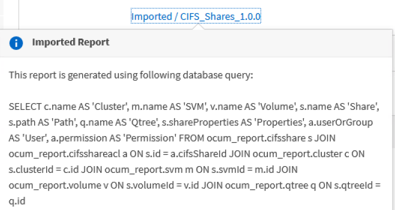

= Planification des rapports .rptdesign importés
:allow-uri-read: 
:icons: font
:imagesdir: ../media/

[role="lead"]
Vous pouvez planifier les rapports existants qui ont été créés et importés dans une version antérieure d'Unified Manager.

== Description de la tâche

La planification des rapports importés nécessite les éléments suivants :

* Rapports de fichiers .rptdesign importés dans une version antérieure d'Unified Manager
* Applicable lors de la mise à niveau vers Unified Manager 9.6 GA ou version ultérieure

Après la mise à niveau vers Unified Manager 9.6 GA ou version ultérieure, la page Report Schedules répertorie les rapports importés. Vous pouvez modifier le planning de ces rapports pour spécifier les adresses e-mail, la fréquence et le format du destinataire (PDF ou CSV). Sinon, ces rapports ne peuvent pas être modifiés ou affichés dans l'interface utilisateur d'Unified Manager.

== Étapes

. Ouvrez la page *Report Schedules*. Si vous avez importé des rapports, un message s'affiche.
+
image::../media/message-non-scehduled-reports.png[rapports de messages non ehdulés]

. Cliquez sur le nom *View* pour afficher la requête SQL utilisée pour générer le rapport.
+

. Cliquez sur l'icône plus image:../media/more-icon.gif[""], Cliquez sur *Modifier*, définissez les détails de la planification du rapport et enregistrez le rapport.
+
[NOTE]
====
Vous pouvez également supprimer tous les rapports indésirables de l'icône plus image:../media/more-icon.gif[""].

====

